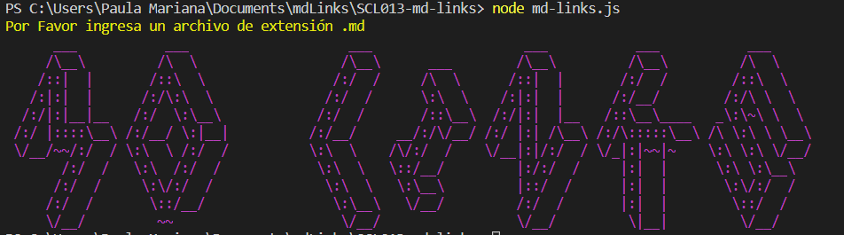

# Markdown Links

## Índice

* [1. ¿Que es Md-Links?](#1-preámbulo)
* [2. Diagrama de Flujo](#2-resumen-del-proyecto)
* [3. Instalación](#3-objetivos-de-aprendizaje)
* [4. Utilización de librería](#4-consideraciones-generales)
* [5. Ejemplo](#5-criterios-de-aceptación-mínimos-del-proyecto)

***

## 1. ¿Que es Md-Links?

Markdown Links es una librería de Node.js que nos permite buscar en un directorio todos los archivos en formato Markdown que en su interior contengan link y asi poder validar el estado actual de cada uno de ellos.

## 2. Diagrama de Flujo

## 3. Instalación
Para instalar la librería debes correr el siguiente comando:
#### `npm install cep-md-links`

## 4. Herramientas Utilizadas

La libreria contiene las siguientes dependencias:
* Node.js
* File System
* Node-fetch
* Jsdom
* Markdown-it
* Chalk
* Figlet

## 5. Uso de la librería
Para hacer uso de la libreria:

Debes importarla dentro de tu archivo js de la siguiente manera:
#### `const nombre = require('cep-md-links')`

La librería te ofrece la siguiente información:

* Ruta del directorio.
* Nombre del archivo .md
* Total de links encontrados en el archivo.
* Lista de archivos con su url y status.
* Total de archivos rotos

## 5. Ejemplo

Puedes hacer uso de esta libreria a traves de una serie de instrucciones.

⦁ Sin opciones: debes ejecutarlo de la siguiente manera a traves del terminal:

#### node md-links <path-to-file>

#### node md-links <path-to-file> [options]
Opcion Validate --v 

